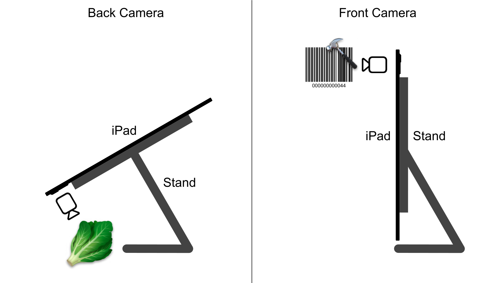

# Simple Search

Simple Search is a demo app that showcases the capabilities of [Couchbase Capella](https://www.couchbase.com/products/capella/) for data search and synchronization. It provides a comprehensive view of search using AI, vectors, full-text, SQL, indexing, and syncing data with the Capella cloud.

The app is designed to demonstrate real-time search using the devices camera coupled with AI and Capella's search and sync capabilities, making it an excellent utility for experiencing their unique ability to turbocharge the speed and reliability of business critical applications.

[Download](https://apps.apple.com/us/app/simple-search/id6504311724) Simple Search from the App Store today and experience the power of Couchbase Capella's AI, search, and sync capabilities right from the palm of your hand—no additional setup.

[](https://apps.apple.com/us/app/simple-search/id6504311724)
## Introduction

The code is divided into the following six areas demonstrating AI search, vector search, SQL queries, full-text search, indexing, and data sync with the cloud:

### AI Search

The `Database.search(image: UIImage)` function demonstrates AI search capabilities. It uses the SQL and Vector Search functions below to find database results base on AI predictions from an image.

```swift
func search(image: UIImage) -> [Product] {
    // Search with barcode
    if let barcode = AI.barcode(from: image), let product = search(barcode: barcode) {
        return [product]
    }
    
    // Search with embedding
    if let embedding = AI.embedding(for: image) {
        let products = search(vector: embedding)
        return products
    }
    
    return []
}
```

### Vector Search

The `Database.search(vector: [NSNumber])` function demonstrates the vector search capabilities.

```swift
func search(vector: [NSNumber]) -> [Product] {
    // SQL
    let sql = """
        SELECT name, price, location, image
        FROM products
        WHERE VECTOR_MATCH(EmbeddingVectorIndex, $embedding, 10)
          AND VECTOR_DISTANCE(EmbeddingVectorIndex) < 0.25
        ORDER BY VECTOR_DISTANCE(EmbeddingVectorIndex), name
    """
    
    // Create the query.
    let query = database.createQuery(sql)
    query.parameters = Parameters()
        .setArray(vector, forName: "embedding")
    
    // Execute the query and get the results.
    var products = [Product]()
    for result in query.execute() {
        if let name = result["name"].string,
           let price = result["price"].number,
           let location = result["location"].string,
           let imageData = result["image"].blob?.content,
           let image = UIImage(data: imageData)
        {
            let product = Product(name: name, price: price.doubleValue, location: location, image: image)
            products.append(product)
        }
    }
    
    return products
}
```

### SQL Query

The `Database.search(barcode: String)` function demonstrates SQL query capabilities.

```swift
private func search(barcode: String) -> Product? {
    // SQL
    let sql = """
        SELECT name, price, location, image
        FROM products
        WHERE barcode = $barcode
        LIMIT 1
    """
    
    // Create the query
    let query = database.createQuery(sql)
    query.parameters = Parameters()
        .setString(barcode, forName: "barcode")
    
    // Return the first search result
    if let result = query.execute().next(),
       let name = result["name"].string,
       let price = result["price"].number,
       let location = result["location"].string,
       let imageData = result["image"].blob?.content,
       let image = UIImage(data: imageData)
    {
        let product = Product(name: name, price: price.doubleValue, location: location, image: image)
        return product
    }
    
    return nil
}
```

### Full-Text Search

The `Database.search(search: String)` function demonstrates full-text search capabilities.

```swift
func search(string: String) -> [Product] {
    // SQL
    let sql = """
        SELECT name, price, location, image
        FROM products
        WHERE MATCH(NameAndCategoryFullTextIndex, $search)
        ORDER BY RANK(NameAndCategoryFullTextIndex), name
    """
    
    // Create the query.
    let query = database.createQuery(sql)
    query.parameters = Parameters()
        .setString(searchString, forName: "search")
    
    // Enumerate through the query results.
    var products = [Product]()
    for result in query.execute() {
        if let name = result["name"].string,
           let price = result["price"].number,
           let location = result["location"].string,
           let imageData = result["image"].blob?.content,
           let image = UIImage(data: imageData)
        {
            let product = Product(name: name, price: price.doubleValue, location: location, image: image)
            products.append(product)
        }
    }
    
    return products
}
```

### Indexing

The `Database` class demonstrates creating indexes for fast searches.

```swift
// Initialize the value index on the "name" field for fast sorting.
let nameIndex = ValueIndexConfiguration(["name"])
collection.createIndex(withName: "NameIndex", config: nameIndex)

// Initialize the value index on the "barcode" field for fast searching.
let barcodeIndex = ValueIndexConfiguration(["barcode"])
collection.createIndex(withName: "BarcodeIndex", config: barcodeIndex)

// Initialize the vector index on the "embedding" field for image search.
var vectorIndex = VectorIndexConfiguration(expression: "embedding", dimensions: 768, centroids: 100)
vectorIndex.metric = .cosine
collection.createIndex(withName: "EmbeddingVectorIndex", config: vectorIndex)

// Initialize the full-text search index on the "name" and "category" fields.
let ftsIndex = FullTextIndexConfiguration(["name", "category"])
collection.createIndex(withName: "NameAndCategoryFullTextIndex", config: ftsIndex)
```

### Sync

The `Database.startSync()` function demonstrates how to sync with a Couchbase Capella cloud endpoint.

```swift
private func startSync() {
    // Set up the sync endpoint.
    let target = URLEndpoint(url: endpoint.url)
    var config = ReplicatorConfiguration(target: target)
    config.addCollection(collection)
    config.replicatorType = .pull
    config.authenticator = BasicAuthenticator(username: endpoint.username, password: endpoint.password)

    // Create and start the replicator.
    let replicator = Replicator(config: config)
    replicator.start()
}
```
## Demo the Project

The demo app is designed to be run on an iPhone or iPad in the following configurations:

### iPad Setup

The iPad setups work well for stationary kiosks and wall displays. Use cases include point-of-sale, self checkout, self check-in, price lookup, ticket validation, and more.



This is the stand that I'm using for my iPad Pro (12.9-inch, 3rd generation). You can find it [here](https://www.amazon.com/dp/B0C1MZGG1P) on Amazon.


### iPhone Setup

The iPhone setups work well for mobile use. Use cases include personal shopping, self checkout, order collection, package delivery, ticket validation, and more.


### Demo Cards

The demo app is trained to recognize the products in it's catalog using the camera. To help demonstrating these capabilities, [download the demo cards](https://raw.githubusercontent.com/waynecarter/simple-search/main/images/demo-cards.pdf), display them from your computer or print them out, and scan the cards to find the corresponding products in the app. Here are a few examples of cards from the set:


## Run the Project

1. Clone or download this repository
2. [Download](https://www.couchbase.com/downloads/?family=couchbase-lite) the latest `CouchbaseLiteSwift.xcframework` and `CouchbaseLiteVectorSearch.xcframework`, and copy them to the project's `Frameworks` directory.
3. Open the project in Xcode.
4. Run the app on a phone or tablet.

### Source Files

To explore the code, start with the following source files:

* `Database.swift`: Manages the search and sync features.
* `AI.swift`: Provides the AI features.
* `Camera.swift`: Manages the camera.
* `Settings.swift`: Manages the settings.
